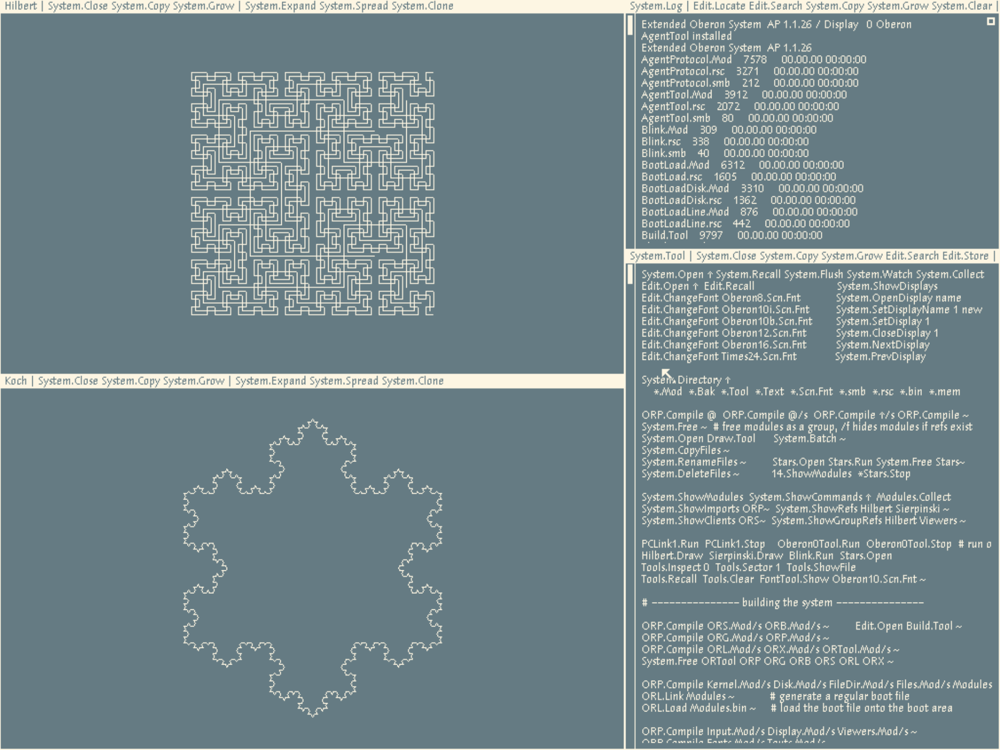

# oberon-agent

> While people are busy putting agents into the OS, let's put the OS into the agent.

## The idea

Oberon is unusual: modules can be compiled, loaded, and unloaded *in the running
system* — safely so on Extended Oberon. With the right tools an agent can change the
live system from the inside: edit a module, recompile, swap the old code out, swap the
new code in, keep going without rebooting. And the source for the entire system fits in
a decent LLM's context window — do the math yourself.

Three pieces make this work:

- **`oat`** — *oberon-agent-tool* — a stateless Rust CLI. Each invocation opens the
  serial line — an emulator FIFO or a real FPGA's UART — sends one PUT/GET/CALL/EDIT
  request, prints the result, and exits.
- **`AgentTool.Mod`** — the on-system half, running *inside* Oberon. It listens on the
  serial line and answers each request from within the live system: writing files,
  calling commands, hot-swapping modules. One per variant
  ([Project Oberon](Mod/ProjectOberon/AgentTool.Mod),
  [Extended Oberon](Mod/ExtendedOberon/AgentTool.Mod)), over a
  [shared wire protocol](Mod/Common/AgentProtocol.Mod).
- **`skill/oberon-agent/SKILL.md`** — the agent-facing rules. Drop it into
  `~/.claude/skills/oberon-agent/SKILL.md` (or symlink) and any Claude Code session
  with `oat` on PATH can drive a live Oberon.

```
LLM <-> agent (e.g. Claude Code) <--> oat <--> RS232 wire protocol <--> AgentTool.Mod (on Oberon)
```

## Quick start

### 1. Dependencies

- Rust toolchain: `cargo`
- Unix tools: `make`, `tar`, `patch`, `curl` (or `wget`)

### 2. Clone repo with submodules

```sh
git clone --recurse-submodules https://github.com/zxygentoo/oberon-agent.git
cd oberon-agent
```

If cloned without `--recurse-submodules`:

```sh
cd oberon-agent
git submodule update --init --recursive
```

### 3. Build stuff

```sh
make
```

This will build:
- the `oat` executable at `oat/target/release/oat`
- the vendored host tools in `vendor/oberon-risc-emu-rs/target/release/`
- disk images for Project Oberon and Extended Oberon in `DiskImage/`

(`make test` runs oat's unit suite plus a live battery against both images,
booted headless in the emulator.)

### 4. Install the skill

Copy it to your skill folder, or link it:

```sh
ln -s "$PWD/skill/oberon-agent" ~/.claude/skills/oberon-agent
```

### 5. Install `oat` (optional)

```sh
cargo install --path oat
```

Optional because the oberon-agent skill will also look for `oat` in `.`, `./bin/`, and
`./tools/` — or you can just tell your agent where the binary is.

### 6. Boot the system

Using the emulator:

```sh
mkfifo /tmp/p.in /tmp/p.out          # once
make eo-emu                          # or `make po-emu`, or run `risc` directly
```

Or drive a real Oberon on FPGA silicon — point `oat` at the serial device with
`--serial /dev/ttyUSB1` (`--baud`, `--char-delay-us`, and `--retries` tune the UART
link; the defaults — **115200 8N1, 600 µs char-delay** — match the 60 MHz FPGA build's
UART and stream reads ~5× faster than the old 19200. For a faithful 25 MHz build use
`--baud 19200 --char-delay-us 1000`). This has been validated on a Nexys 4;
see [REAL-SERIAL.md](REAL-SERIAL.md) for the transport details and gotchas.

### 7. Play!

In your favorite harness, load the `/oberon-agent` skill. It starts by locating
`oat` and connecting to the live Oberon — after that, just talk:

- *"Read the relevant source and explain how Oberon's graphics subsystem works."*
- *"Use Hilbert.Mod as an example, add a Koch.Mod that draws a Koch curve."*



You get the idea :)

> [!TIP]
> Use Extended Oberon for heavy modification — it has safe module unloading, so
> the system is much harder to hang. It's not hang-proof, though: the system is a
> single cooperative loop, so a fast background task or repeated live reloads can
> still wedge it. SKILL.md's "Emulator vs real hardware" section has the details.

## Upstream pieces we depend on

**[`vendor/oberon-risc-emu-rs/`](https://github.com/zxygentoo/oberon-risc-emu-rs)**
(git submodule) — Rust port of Wirth's RISC5 emulator and host tools:

- `risc` — runs the emulator, windowed or `--headless`.
- `extract-source` — pulls Oberon source out of a stock disk image.
- `build-po-image` / `build-eo-image` — compile a source tree and produce a bootable
  `.dsk`. We use both — one per variant.
- `ob2txt` / `txt2ob` — convert between Oberon's CR-terminated module format and plain
  LF text, so patches stay readable in git.
- `DiskImage/Oberon-2020-08-18.dsk` — the stock PO2013 disk image we extract from.

**Extended Oberon stock image** — downloaded by `make` (not vendored) from
[`andreaspirklbauer/Oberon-extended`](https://github.com/andreaspirklbauer/Oberon-extended):
the single file `Documentation/S3RISCinstall.tar.gz` lands in `build/` and is reused
across builds. Requires `curl` or `wget`.

## License

MIT — see [`LICENSE`](LICENSE).
